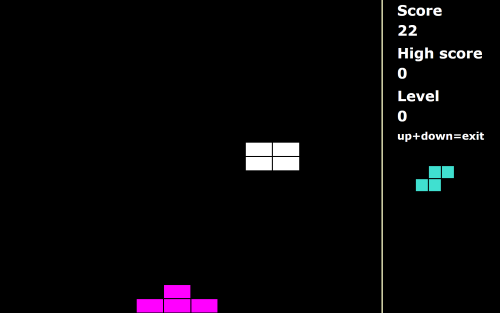

# KiepTetris
### C# WPF version of Tetris that can be controlled by mouse or keyboard
This is a WPF version of the popular tetris game. It was designed with limited input possibilities in mind. It can be controlled with the mouse or with the keyboard.

Usage:
 - Mouse move = move left or right
 - Mouse left click = rotate
 - Mouse right click = fast down
 - Keyboard left arrow = move left
 - Keyboard right arrow = move right
 - Keyboard up arrow = rotate
 - Keyboard down arrow = fast down
 - Keyboard up+down arrow = exit

This application uses a [low level keyboard hook](LowLevelKeyboardHook.cs), in order to catch the key presses even if another application (like [Tobii Dynavox Communicator](http://www.tobiidynavox.com/)) is preventing the keys to reach the application.

See [KiepProjects](https://github.com/Joozt/KiepProjects) for an overview of all Kiep projects.
